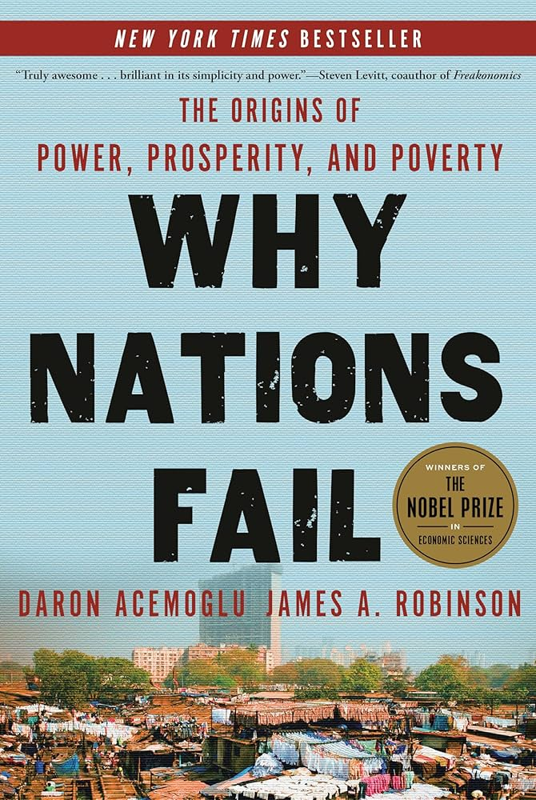

# freedom-language-exploration
This mini-project explores the relationship between institutional structures and linguistic evolution. 

Inspired by Nobel Laureates Daron Acemoglu and James A. Robinson’s Why Nations Fail, I conducted a linear regression analysis to test if inclusive institutions correlate with higher levels of morphological complexity in national primary languages.

  

The primary argument in their book asserts that inclusive political institutions result in inclusive economic institutions and that the two exist in a virtuous cycle, while extractive institutions do the opposite. Using this hypothesis as a jumping-off point, I wanted to explore a different social sciences question blending institutional economics and Linguistic Determinism (the idea that a person's linguistic constraints shape their cognitive processes / perception of reality).
