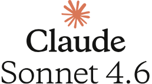

# freedom-language-exploration
This mini-project explores the relationship between institutional structures and linguistic evolution. 

Inspired by Nobel Laureates Daron Acemoglu and James A. Robinson’s Why Nations Fail, I conducted a linear regression analysis to test if inclusive institutions correlate with higher levels of morphological complexity in national primary languages.

  

The primary argument in their book asserts that inclusive political institutions result in inclusive economic institutions and that the two exist in a virtuous cycle, while extractive institutions do the opposite. Using this hypothesis as a jumping-off point, I wanted to explore a different social sciences question blending institutional economics and Linguistic Determinism (the idea that a person's linguistic constraints shape their cognitive processes / perception of reality).

  

The main question I wanted to answer was whether countries with more inclusive institutions early in the last millennium (more colonial-enabled) were rewarded with greater linguistic complexity (maybe a rough proxy for more nuanced thought) today. In other words, would a country's 21st century citizens enjoy the privilege of more nuanced thought thanks to their country's more democratic foundations from 1000 to 2000 AD. This would be mostly due to international expansion forcing colonial powers to evolve more expansive vocabularies as they came into contact with foreign ideas and technologies.

  

Though I've worked with it before, my day-to-day role currently does not use much Python, so I figured this would be a perfect first foray into vibe-coding. For this project, I used a combination of Gemini 3 and Claude Sonnet 4.6. 

The idea was fairly straight-forward. I wanted to plot freedom index as the independent variable against primary language complexity as the independent variable to support my hypothesis.

  
  

First, I needed to pull a dataset for freedom index. This was done by pulling CL (Civil Liberties) and PR (Political Rights) values from the well-known R TidyTuesday project repository. Gemini proposed the method of averaging the two values (both on a scale of 1 to 7) and inverting them to make for easier interpretation once plotted. 

Second, I needed to pull a dataset that included country or country ISO (3-letter code used to identify a country) in one field and language complexity (of what is considered the country's) primary language in another field.

The second step was undoubtedly the trickier of the two because the second dataset likely does not exist. This meant that I needed to enlist the help of Gemini and Claude to work through several intermediate steps that would achieve a data frame like this. Here is the process that was carried out to make this step a success:

1) Gemini created a hard-coded "primary_languages" definition from lines 94 through 185 in the script using "*general knowledge*" after giving the reason that "*finding a single, programmatically accessible external source that reliably provides this specific ISO to primary_language mapping for all countries, and is also perfectly aligned with WALS language names, has been challenging.*"

2) It then created "lang_lookup" dictionary mapping primary language to complexity score for each ISO.

3) Gemini employed a "lang_rows" loop to cycle through ISO:primary language pairs in the primary_languages definition and attach complexity scores from the "lang_lookup" dictionary.

Finally 😮‍💨 it was all summed into the "lang_df" data frame that was merged with the "hfi_df" freedom index data frame with ISO as the common field. Wow! Pretty cool! 😁
